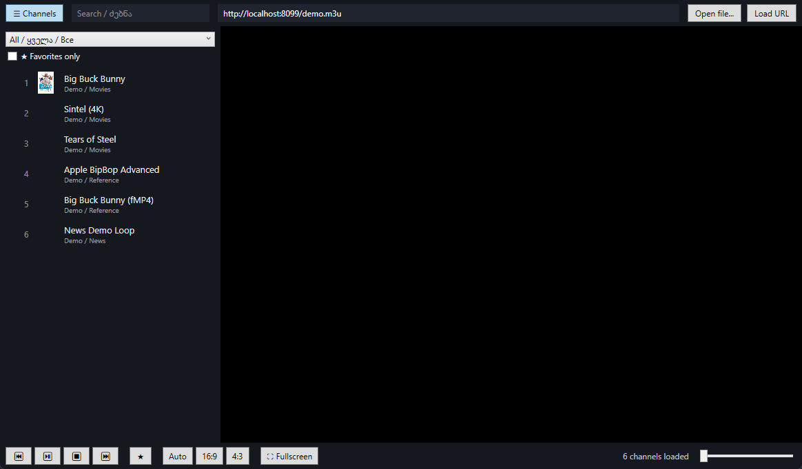
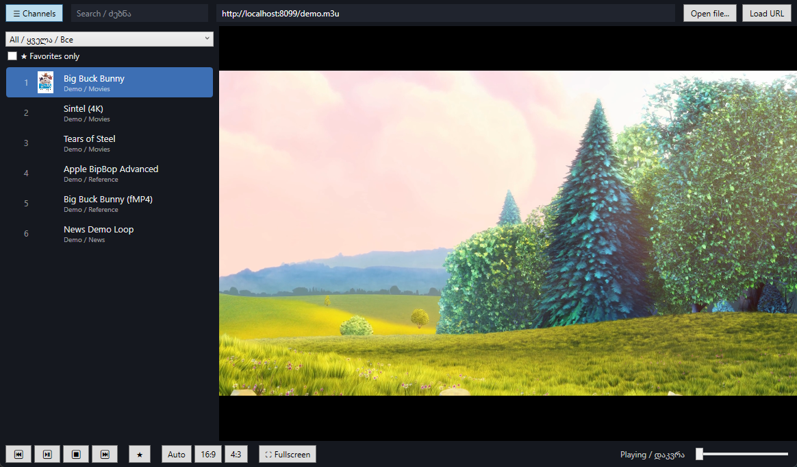

# IPTV Player

A lightweight Windows desktop **IPTV / M3U player** built with **WPF (.NET 8)** and
**LibVLCSharp**. Load any `.m3u` / `.m3u8` playlist from a local file or an HTTP(S)
URL, browse channels by group, search, mark favorites, and watch — with smooth live
playback tuned for IPTV streams.

The UI ships with English / Georgian / Russian hints (ქართული / Русский).

---

## Screenshots

### Browse channels
Group filter, search, favorites, channel numbers and logos in a dark, virtualized list.



### Watch
Direct native video surface, transport controls, aspect-ratio presets, volume and fullscreen.



---

## Features

- **Playlists** — open a local `.m3u` / `.m3u8` file or load one from an HTTP(S) URL.
  The last-used URL is remembered and auto-loaded on startup.
- **Channel browser** — virtualized list with channel number, logo, name and group;
  filter by **group**, free-text **search**, and a **Favorites-only** toggle.
- **Favorites** — toggle per channel; persisted across sessions.
- **Transport** — previous / play-pause / stop / next, favorite toggle,
  **aspect ratio** presets (Auto / 16:9 / 4:3), volume, and **fullscreen**.
- **Smooth live playback** — a dedicated VLC worker thread, debounced channel
  "zapping", a larger jitter buffer, and an automatic **10-bit HDR → software-decode
  fallback** for GPUs that can't hardware-decode it.
- **Reliable video surface** — the stream renders straight into a native HWND
  (WinForms panel hosted in WPF), avoiding DWM-thumbnail compositing issues on some GPUs.
- **Settings persistence** — volume, aspect ratio and last playlist are saved to
  `%APPDATA%\IptvPlayer\`.

## Keyboard & mouse shortcuts

| Input | Action |
| --- | --- |
| `Up` / `Down` | Previous / next channel |
| `Left` / `Right` | Volume down / up |
| `Space` | Play / pause |
| `F11` | Toggle fullscreen |
| `Esc` | Exit fullscreen |
| Mouse wheel (over video) | Adjust volume |
| Mouse wheel (over list) | Scroll channels |

---

## Getting started

### Requirements
- Windows 10/11, **x64** (LibVLC native binaries are x64-only).
- .NET 8 Desktop Runtime (the project rolls forward onto a newer installed runtime).

### Build & run
```powershell
dotnet build IptvPlayer.csproj -c Release
dotnet run  --project IptvPlayer.csproj
```

### Publish (self-contained app folder)
```powershell
dotnet publish IptvPlayer.csproj -c Release -r win-x64 -o publish
```

### Build a Windows installer
A branded [Inno Setup](https://jrsoftware.org/isdl.php) script is included. After
publishing to `publish\`:
```powershell
& "C:\Program Files (x86)\Inno Setup 6\ISCC.exe" IptvPlayer.iss
# -> installer-output\IptvPlayer-Setup-1.0.0.exe
```

---

## Tech stack

| Component | Purpose |
| --- | --- |
| WPF + WinForms host | UI shell and native video surface |
| [LibVLCSharp](https://github.com/videolan/libvlcsharp) 3.8.x + VideoLAN.LibVLC.Windows 3.0.21 | Media playback engine |
| [CommunityToolkit.Mvvm](https://github.com/CommunityToolkit/dotnet) | MVVM (observable properties, relay commands) |

## Project layout

```
Models/      Channel, Playlist, AppSettings
Services/    M3UParser, PlaylistLoader, Favorites & Settings stores, Log
ViewModels/  MainViewModel (playback orchestration, filtering, threading)
Views/       MainWindow (XAML + code-behind)
scripts/     demo playlist + screenshot capture helper
assets/      app icon, installer artwork, screenshots
```

## Notes

- The video is played on a **single dedicated thread** — every libvlc call
  (Play / Stop / Volume / AspectRatio) is queued there and never runs on the UI
  thread, which previously froze and dead-locked the app on heavy 4K streams.
- This repo ships **no playlists or stream credentials**. Bring your own provider
  URL or M3U file. The screenshots above use a small demo playlist of public test
  streams (`scripts/demo-playlist.m3u`).
